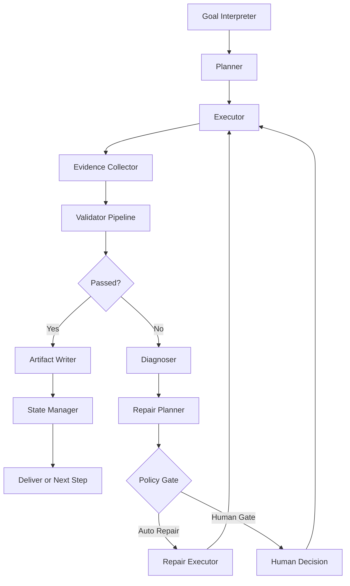
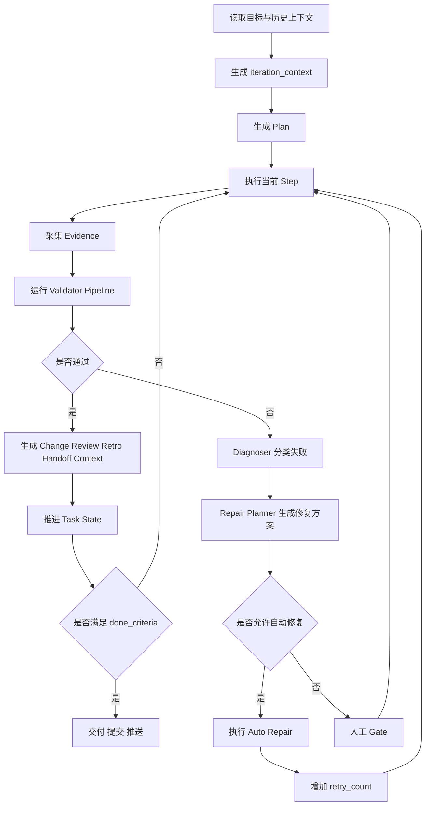

# 输出流程自动闭环与自我修复机制设计稿

## 1. 设计目标

- 将当前工程从“人工维持流程”升级为“系统驱动流程”。
- 让项目围绕 `Goal -> Plan -> Execute -> Validate -> Repair -> Review -> Deliver` 运转，而不是围绕“临时会话记忆”运转。
- 在当前探索阶段优先实现 `B` 型闭环：
  - 自动产出
  - 自动校验
  - 自动诊断
  - 自动生成修复方案
  - 高风险决策才进入人工 gate
- 架构上预留升级到 `C` 型闭环的能力：仅对高确定性、低副作用问题执行自动修复与自动重试。

## 2. 设计边界

### 2.1 in scope

- 项目级输出过程
- `plan/change/review/retro/handoff/context/state` 的生成、校验与闭环
- 失败诊断、修复建议、自动重试与停止条件
- 通用 validator/repair loop

### 2.2 out of scope

- 具体业务执行器的实现细节
- Playwright 或其它单一测试框架的页面交互设计
- 某个特定产品需求的业务规则细节

## 3. 当前工程判断

当前仓库已经具备闭环骨架，但没有自动闭环引擎。

### 3.1 已有能力

- `task-state.json` 已定义主状态机与重试预算
- `workflow/check_quality.py` 已做基础文件与四件套守卫
- `workflow/run.py` 已做状态合法性守卫
- `AGENTS.md`、whitepaper、skills 已定义流程规范
- `harness/` 目录已经能沉淀 change/review/retro/handoff

### 3.2 当前断点

- 没有统一 orchestrator 驱动整轮执行
- 失败后没有自动进入 `diagnose -> repair -> retry`
- `review/retro/handoff` 目前更偏向“人类记录”，还不是“机器下一步输入”
- 缺少标准化的执行证据包，导致失败时容易先怀疑 prompt，而不是先看执行现场

## 4. 设计原则

### 4.1 先观测，再修复

任何失败都必须先看：

1. 执行过程
2. 执行状态
3. 执行环境
4. 校验规则命中
5. 产物内容
6. 最后才看 prompt

### 4.2 反馈闭环必须可机读

`change/review/retro/handoff/context` 既要保留人类可读形式，也要能被下一轮自动消费。

### 4.3 自动修复必须可停止

每次自动修复都必须显式记录：

- `failure_fingerprint`
- `retry_budget`
- `stop_condition`
- `escalation_rule`

### 4.4 执行器与治理器解耦

业务执行器负责“按 plan 做事”；治理层负责“判断是否做对、错了怎么办、是否继续”。

### 4.5 先做 B，再选择性升级到 C

探索阶段优先建立稳健的半自动闭环，再把高确定性问题逐步升级为全自动修复。

### 4.6 先定治理协议，再进入实施

在正式进入实施前，必须先定死以下协议：

- 真相源
- 单执行者
- 重试计数规则
- `quality gate` 与 `review artifact` 的职责边界

否则系统容易在自动修复阶段退化为人工仲裁、重复执行或无意义重试。

## 5. 目标架构



### 5.1 Goal Interpreter

输入：

- 当前用户目标
- `task-state.json`
- 最新 `change/review/retro/handoff/context`

输出：

- `iteration_context`

职责：

- 明确本轮目标、边界、风险与历史约束
- 形成本轮唯一上下文输入，避免会话漂移

### 5.2 Planner

输出：

- `plan artifact`

职责：

- 定义 steps
- 定义 done_criteria
- 定义 validation gates
- 定义 retry policy
- 定义 escalation points

### 5.3 Executor

输出：

- `execution result`
- 原始日志
- 产物 diff

职责：

- 执行当前 plan step
- 不负责解释失败，不直接推进主状态

### 5.4 Evidence Collector

输出：

- `execution evidence package`

标准证据包至少包含：

- `process_snapshot`
- `state_snapshot`
- `environment_snapshot`
- `artifact_snapshot`
- `validator_results`

### 5.5 Validator Pipeline

固定顺序：

1. `schema`
2. `rule`
3. `state`
4. `static`
5. `runtime`
6. `quality gate`

输出：

- `validation_report`

### 5.6 Diagnoser

职责：

- 对失败做分类，不直接修复

建议失败类型：

- `schema_failure`
- `rule_failure`
- `state_failure`
- `environment_failure`
- `runtime_failure`
- `artifact_quality_failure`
- `unknown_failure`

输出：

- `failure_class`
- `failure_fingerprint`
- `root_cause_hypothesis`

### 5.7 Repair Planner

职责：

- 基于失败类型输出修复方案

输出：

- `repair_plan`
- `repair_scope`
- `expected_effect`
- `risk_level`
- `auto_repair_allowed`

### 5.8 Policy Gate / Escalation Gate

职责：

- 决定自动修复、人工确认或终止升级

判定依据：

- 风险等级
- 修改范围
- 是否触达主状态定义
- 是否涉及外部环境
- 是否超过 retry budget

### 5.9 V1 固定治理协议

#### 5.9.1 真相源规则

V1 采用“控制面单一真相源 + 对象级事实真相源 + 人类视图派生”的分层规则：

- `task-state.json`：唯一控制面真相源，只负责工作流状态、状态迁移、运行所有权与重试预算
- `iteration-context.json`、`validation-report.json`、`failure-record.json`、`repair-plan.json`、`execution-evidence.json`：各自作为对应对象的机器事实真相源
- `plan/change/review/retro/handoff/context` 的 markdown 文档：只做人类阅读视图，不作为自动 loop 的运行时输入

冲突仲裁规则：

- 状态冲突：以 `task-state.json` 为准
- 对象内容冲突：以对应 `.json` 为准
- 若 markdown 与对应 `.json` 不一致：统一判定为 `artifact_sync_failure`
- `artifact_sync_failure` 的默认修复动作是重生成 markdown 视图，而不是人工比对合并

#### 5.9.2 单执行者规则

V1 严格限制同一 iteration 只能有一个自动 loop runner 具备写权限。

建议在 `task-state.json` 中固定以下运行字段：

- `active_run_id`
- `run_owner`
- `run_status`
- `lease_expires_at`

运行规则：

- 任何状态推进、repair 执行、机器事实产物写入，都必须带当前 `run_id`
- 未持有有效 lease 的 runner 只能只读，不能写入
- 仅当 lease 过期或明确释放时，新的 runner 才允许接管
- 若检测到两个 runner 竞争同一 iteration，直接判定为阻断性治理错误并升级人工 gate

#### 5.9.3 重试计数规则

V1 不再只依赖一个全局 `retry_count`，而采用三层计数：

- `fingerprint_retry_limit = 2`
- `step_retry_limit = 3`
- `iteration_retry_limit = 5`

计数语义：

- 同一 `failure_fingerprint` 在同一 step 内，最多自动修复 2 次
- 同一 step 无论失败类型如何变化，最多自动修复 3 次
- 同一 iteration 内全部自动修复尝试合计最多 5 次

重置规则：

- 当前 step 成功后，`fingerprint` 与 `step` 级计数清零
- `iteration` 级计数在该轮结束前不清零
- 命中任一上限后，必须停止自动修复并进入人工 gate

#### 5.9.4 Quality Gate 与 Review Artifact 分离

V1 将原设计中的 `review gate` 正式更名为 `quality gate`。

职责分离如下：

- `quality gate`：运行时机器校验关口，属于 validator pipeline 的一部分
- `review artifact`：面向人类的评审摘要，由校验结果派生生成

运行规则：

- validator pipeline 产出 `validation-report.json`
- `review.md` 根据 `validation-report.json` 渲染生成
- 自动 loop 读取的是 `validation-report.json`、`failure-record.json` 与 `task-state.json`
- `review.md` 不作为运行时决策输入，避免出现循环依赖或语义冲突

## 6. 目标工作流



## 7. Feedback Loop 设计

### 7.1 闭环位置

Feedback Loop 必须放在每次 validator 失败之后立即触发，而不是等到下一轮会话才处理。

正确闭环：

`execute -> evidence -> validate -> diagnose -> repair -> retry`

### 7.2 闭环层级

建议分三层：

- `step loop`：只修当前 step 的失败
- `iteration loop`：修本轮 plan 未达标问题
- `task loop`：修主线方向性偏差

### 7.3 闭环输入

- 最近失败的 `validation_report`
- 当前 `task-state`
- 最近一次 `retro`
- 最近一次 `handoff`
- 最近一次成功基线或基准产物

### 7.4 闭环输出

- 失败类型
- 修复策略
- 是否自动执行
- 当前重试次数
- 是否升级人工

## 8. 失败诊断顺序

为避免遇到问题就先改 prompt，诊断顺序固定如下。

### 8.1 执行过程

回答：

- 实际执行了哪些步骤
- 最后成功步骤是什么
- 失败发生在哪一步
- 是否发生跳步、重复或中断

### 8.2 执行状态

回答：

- 当前状态是否合法
- 状态是否与 plan 匹配
- 是否发生非法迁移
- `retry_count` 是否接近上限

### 8.3 执行环境

回答：

- 使用了什么配置
- 外部依赖是否可用
- 环境变量是否完整
- 权限、文件系统、网络是否满足前提

### 8.4 校验规则

回答：

- 哪个 validator 失败
- 属于哪一类失败
- 是阻断型还是可修复式

### 8.5 产物内容

回答：

- 缺了什么
- 格式错了什么
- 为何未通过验收

### 8.6 Prompt

只有前五项解释不通时，才检查 prompt 是否有歧义、上下文缺失或边界定义错误。

## 9. 通用 Validator / Repair Loop

不建议把机制收窄为 `ruff loop`。更好的抽象是 `validator loop`，其中 `ruff` 只是某一个 validator。

### 9.1 标准循环协议

```text
1. execute
2. collect evidence
3. run validators
4. classify failure
5. generate repair plan
6. apply repair
7. rerun impacted validators
8. pass -> finalize
9. fail -> retry or escalate
```

### 9.2 Validator 接口

每个 validator 至少返回：

- `validator_name`
- `stage`
- `passed`
- `severity`
- `fingerprint`
- `message`
- `affected_artifacts`
- `repair_hint`

### 9.3 Repair 接口

每个 repair action 至少包含：

- `repair_id`
- `target`
- `failure_fingerprint`
- `action_type`
- `risk_level`
- `can_auto_apply`
- `rollback_hint`

### 9.4 自动修复准入规则

仅当同时满足以下条件时允许自动修复：

- 单点失败，边界清晰
- 修复动作局部且可预测
- 不改变主目标与主状态定义
- 不依赖业务人工判断
- 不涉及高风险外部操作
- 未超过 retry budget

## 10. 产物模型升级建议

当前产物主要是 markdown，适合人读，但不利于系统消费。建议升级为“双轨产物”。

### 10.1 human-readable

- `plan.md`
- `change.md`
- `review.md`
- `retro.md`
- `handoff.md`
- `context.md`

### 10.2 machine-readable

- `iteration-context.json`
- `validation-report.json`
- `failure-record.json`
- `repair-plan.json`
- `execution-evidence.json`

规则：

- 以上 `.json` 是自动 loop 的运行时输入
- 对应 markdown 只作为可读视图，不承担运行时仲裁职责

### 10.3 最关键的结构化对象

- `iteration_context`
- `validation_report`
- `failure_record`
- `repair_plan`

### 10.4 review 的角色升级

`review` 不应只是结论记录，而应明确：

- 哪些 validator 通过或失败
- 当前风险等级
- 是否允许自动 repair
- 是否允许推进状态

同时需要明确：

- `review.md` 是 `validation-report.json` 的人类可读摘要
- 运行时校验关口统一命名为 `quality gate`
- 不再使用 `review artifact` 反向驱动自动 loop 决策

## 11. 人工介入点设计

最少人工干预不等于零人工。建议只保留以下人工 gate：

1. 目标变更
2. 高风险修复
3. 多次自动修复失败
4. 外部环境异常或权限问题

除此之外，应尽量由系统自动完成。

## 12. 推荐演进路径

### Phase 1：观测化

先补齐：

- execution log
- state snapshot
- environment snapshot
- artifact snapshot

目标：

- 失败可以稳定复盘
- 不再第一时间怀疑 prompt

### Phase 2：标准化校验

把现有检查统一收敛为 validator pipeline：

- schema
- rule
- state
- static
- runtime

目标：

- 所有失败都能进入统一分类

### Phase 3：半自动 repair

引入 repair planner，但先只自动给方案，不自动执行。

目标：

- 建立稳健的 `B` 型闭环

### Phase 4：选择性自动修复

将高确定性失败升级为自动修复：

- 命名不规范
- 文件缺失
- schema 不满足
- 低风险状态修正建议

目标：

- 向 `C` 型闭环演进

## 13. 成功标准

该机制上线后，应满足：

- 每次执行自动生成完整证据包
- 每次失败都能被分类，而不是笼统归因为“结果不对”
- 每次失败都有 repair plan
- 高确定性问题可自动修复并自动重试
- 人工介入点收敛到关键决策场景
- `review/retro/handoff/context` 能成为下一轮自动输入
- 系统具备明确停止条件，不出现无意义循环

## 14. 本设计的核心判断

- 当前最推荐的目标形态是 `B` 型闭环，而不是直接全自动 `C`
- `Feedback Loop` 必须成为运行时机制，而不是事后总结机制
- 失败定位必须优先看执行过程、执行状态、执行环境
- `ruff loop` 应升级为更通用的 `validator/repair loop`

## 15. 评审关注点

本设计稿提交后，建议优先评审以下问题：

1. `iteration_context`、`validation_report`、`repair_plan` 是否足以支撑后续自动化
2. 人工 gate 是否过多或过少
3. 哪些失败类型适合第一批自动修复
4. 现有 `harness` 文档是否需要同步演进为 markdown + json 双轨
